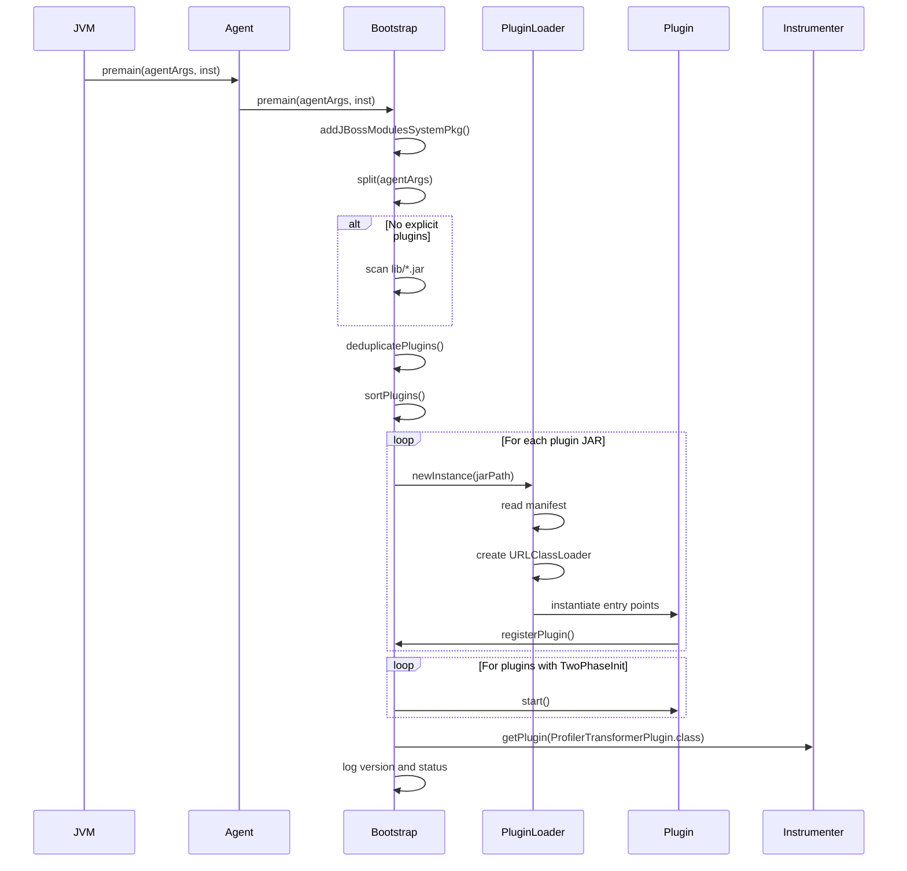

The Agent module provides the entry point for JVM instrumentation and handles the complex process of plugin discovery, loading, and initialization.

## Agent Class

The `Agent` class is the minimal entry point for JVM attachment. It's intentionally simple to keep the agent JAR size small.

**Location**: `agent/src/main/java/com/netcracker/profiler/javaagent/Agent.java`

```java
package com.netcracker.profiler.javaagent;

import com.netcracker.profiler.agent.Bootstrap;
import java.lang.instrument.Instrumentation;

public class Agent {
    public static void premain(String agentArgs, Instrumentation inst) {
        Bootstrap.premain(agentArgs, inst);
    }

    public static void agentmain(String agentArgs, Instrumentation inst) {
        Bootstrap.premain(agentArgs, inst);
    }
}
```

<Info>
  Both `premain()` (static attachment) and `agentmain()` (dynamic attachment) delegate to the same `Bootstrap.premain()` method.
</Info>

## Bootstrap Class

The `Bootstrap` class is the core initialization engine. It resides in the `boot` module and handles all plugin management.

**Location**: `boot/src/main/java/com/netcracker/profiler/agent/Bootstrap.java`

### Key Responsibilities

<CardGroup cols={2}>
  <Card title="Plugin Discovery" icon="magnifying-glass">
    Scans `lib/` directory for plugin JARs or uses explicit comma-separated paths from agent args
  </Card>
  
  <Card title="Plugin Deduplication" icon="filter">
    Prevents duplicate plugins based on `Plugin-Id` manifest attribute
  </Card>
  
  <Card title="ClassLoader Isolation" icon="shield">
    Creates isolated `PluginClassLoader` for each plugin JAR
  </Card>
  
  <Card title="Plugin Registry" icon="book">
    Maintains a registry of loaded plugins accessible via `getPlugin(Class)`
  </Card>
</CardGroup>

### Initialization Flow



### Plugin Discovery

Bootstrap supports two methods for specifying plugins:

<Tabs>
  <Tab title="Automatic Discovery">
    If no agent arguments are provided, Bootstrap automatically scans the `$PROFILER_HOME/lib/` directory:
    
    ```java
    File lib = new File(DumpRootResolverAgent.PROFILER_HOME, "lib");
    File[] jars = lib.listFiles(new FilenameFilter() {
        public boolean accept(File dir, String name) {
            return name.endsWith(".jar");
        }
    });
    ```
    
    All `.jar` files found are loaded as plugins.
  </Tab>
  
  <Tab title="Explicit Specification">
    You can specify plugins explicitly via agent arguments:
    
    ```bash
    -javaagent:profiler-agent.jar=lib/runtime.jar,lib/http.jar,lib/mysql.jar
    ```
    
    Arguments are comma-separated paths to plugin JARs or `.class` files.
  </Tab>
</Tabs>

### Plugin Deduplication

To prevent conflicts, Bootstrap deduplicates plugins based on their `Plugin-Id` manifest attribute:

```java
static List<String> extractPluginId(Attributes attrs) {
    String pluginId = attrs.getValue("Plugin-Id");
    if (pluginId != null) {
        return Collections.singletonList(pluginId);
    }
    // Fallback: extract from Entry-Points
    // Example: EnhancerPlugin_activemq -> activemq
}
```

<Warning>
  If duplicate `Plugin-Id` values are found, **all duplicates are excluded** and a warning is logged. Remove duplicate JARs to resolve this.
</Warning>

**Deduplication Process:**

<Steps>
  <Step title="Read Manifests">
    Extract `Plugin-Id` from each JAR's manifest `META-INF/MANIFEST.MF`
  </Step>
  
  <Step title="Group by ID">
    Group JARs by their `Plugin-Id`. Fallback to extracting from `Entry-Points` if `Plugin-Id` is not present.
  </Step>
  
  <Step title="Detect Duplicates">
    If multiple JARs share the same `Plugin-Id`, mark all as problematic.
  </Step>
  
  <Step title="Exclude Duplicates">
    Remove all problematic JARs from the loading list and log a warning with file paths and versions.
  </Step>
</Steps>

### Plugin Sorting

Plugins are sorted to ensure `runtime.jar` loads first:

```java
Collections.sort(plugins, new Comparator<String>() {
    public int compare(String o1, String o2) {
        return o1.endsWith("runtime.jar") ? -1 
             : o2.endsWith("runtime.jar") ? 1 
             : o1.compareTo(o2);
    }
});
```

<Note>
  The `runtime.jar` plugin must load first because other plugins may depend on its classes.
</Note>

### PluginClassLoader

Each plugin is loaded with an isolated `PluginClassLoader` to avoid classpath conflicts.

**Location**: `boot/src/main/java/com/netcracker/profiler/agent/PluginClassLoader.java`

```java
public class PluginClassLoader extends URLClassLoader {
    public PluginClassLoader(ClassLoader parent, URL[] urls, 
                            String[] entryPoints, String preloadList) {
        // Use null parent to only expose bootstrap classes
        super(urls, parent);
        this.entryPoints = entryPoints;
        this.preloadList = preloadList;
    }
}
```

<AccordionGroup>
  <Accordion title="Parent ClassLoader Strategy">
    By default, `PluginClassLoader` uses `null` as the parent classloader, exposing only bootstrap classes. This prevents plugins from accessing application classes.
    
    **Exception**: If a plugin's manifest contains `Esc-Dependencies: instrumenter`, the parent is set to the `ProfilerTransformerPlugin`'s classloader, allowing access to instrumentation classes.
  </Accordion>
  
  <Accordion title="Class Preloading">
    Plugins can specify `Preload-Classes-List: preload.txt` in their manifest. The listed classes are loaded eagerly to avoid deadlocks during runtime class loading.
    
    ```java
    private void preload(String listName) {
        URL url = findResource(listName);
        BufferedReader br = new BufferedReader(
            new InputStreamReader(url.openStream(), "UTF-8"));
        for (String className; (className = br.readLine()) != null;) {
            Class.forName(className, false, this);
        }
    }
    ```
  </Accordion>
  
  <Accordion title="Entry Points">
    The manifest's `Entry-Points` attribute lists fully-qualified class names to instantiate:
    
    ```
    Entry-Points: com.netcracker.profiler.instrument.enhancement.EnhancerPlugin_http
    ```
    
    Each entry point class is instantiated and added to the plugin registry.
  </Accordion>
</AccordionGroup>

### Plugin Registry

Bootstrap maintains a static registry of loaded plugins:

```java
private static final Map<Class, Object> plugins = new HashMap<Class, Object>();

public static <T> void registerPlugin(Class<T> type, T value) {
    plugins.put(type, value);
}

public static <T> T getPlugin(Class<T> type) {
    return (T) plugins.get(type);
}
```

**Common Plugin Types:**

<ResponseField name="ProfilerTransformerPlugin" type="Interface">
  Provides access to the `Configuration` object. Implemented by the instrumenter module.
  
  **Usage**: `Bootstrap.getPlugin(ProfilerTransformerPlugin.class)`
</ResponseField>

<ResponseField name="EnhancerRegistryPlugin" type="Interface">
  Registry for managing `EnhancerPlugin` instances. Allows plugins to register their enhancers.
  
  **Usage**: `Bootstrap.getPlugin(EnhancerRegistryPlugin.class)`
</ResponseField>

### Two-Phase Initialization

Plugins implementing `TwoPhaseInit` undergo two-phase initialization:

**Interface**: `boot/src/main/java/com/netcracker/profiler/agent/TwoPhaseInit.java`

```java
public interface TwoPhaseInit {
    void start() throws Throwable;
}
```

<Steps>
  <Step title="Phase 1: Construction">
    Plugin classes are instantiated via their no-arg constructor. They can register with the plugin registry during construction.
  </Step>
  
  <Step title="Phase 2: Start">
    After **all** plugins are loaded, the `start()` method is called on plugins implementing `TwoPhaseInit`. This allows plugins to discover and interact with other loaded plugins.
  </Step>
</Steps>

**Example from Bootstrap:**

```java
for (Object impl : impls) {
    if (impl instanceof TwoPhaseInit) {
        try {
            ((TwoPhaseInit) impl).start();
        } catch (Throwable e) {
            throw new RuntimeException("Unable to start plugin " + impl, e);
        }
    }
}
```

### JBoss Modules Integration

For compatibility with JBoss application servers, Bootstrap adds itself to the system packages:

```java
private static void addJBossModulesSystemPkg() {
    String pkgs = System.getProperty("jboss.modules.system.pkgs");
    String profilerPackage = Bootstrap.class.getPackage().getName();
    if (pkgs == null) {
        pkgs = profilerPackage;
    } else {
        pkgs += "," + profilerPackage;
    }
    System.setProperty("jboss.modules.system.pkgs", pkgs);
}
```

<Info>
  This ensures that `com.netcracker.profiler.agent` package is visible across all JBoss modules.
</Info>

### Java Version Detection

Bootstrap detects the Java version at startup:

```java
static {
    String version = System.getProperty("java.version");
    if (version.startsWith("1.")) {
        version = version.substring(2, 3); // 1.8 -> 8
    } else {
        int dot = version.indexOf(".");
        if (dot != -1) { 
            version = version.substring(0, dot); // 11.0.1 -> 11
        }
    }
    JAVA_VERSION = Integer.parseInt(version);
}
```

This is used to exclude plugins that don't support the current Java version:

```java
private static boolean pluginSupported(String jarName) {
    if (jarName.endsWith("reactor-instrument.jar") && JAVA_VERSION < 8) {
        logger.fine("plugin " + jarName + " is not supported");
        return false;
    }
    return true;
}
```

## Boot Packages

The `BOOT_PACKAGES` constant defines packages that are part of the bootstrap classloader:

```java
public static final List<String> BOOT_PACKAGES = Arrays.asList(
    "com.netcracker.profiler.agent", 
    "com.netcracker.profiler.agent.http"
);
```

These packages are loaded by the bootstrap classloader and are visible to all plugins.

## Error Handling

<Warning>
  Plugin loading failures are **fatal**. If a plugin fails to load, a `RuntimeException` is thrown and agent initialization fails.
</Warning>

**Common failure scenarios:**

<AccordionGroup>
  <Accordion title="No Plugins Found">
    ```
    Profiler: bootstrap argument was not specified and was not autodetected.
    ```
    
    **Solution**: Ensure the `lib/` directory exists and contains plugin JARs, or specify plugins explicitly via agent arguments.
  </Accordion>
  
  <Accordion title="Duplicate Plugin-Id">
    ```
    Profiler: Duplicate Plugin-Id 'http' found in multiple JARs.
    None of them will be loaded. Please remove the duplicate JAR(s):
      - /path/to/lib/http-1.0.jar (version=1.0.0)
      - /path/to/lib/http-2.0.jar (version=2.0.0)
    ```
    
    **Solution**: Remove one of the duplicate JARs from the `lib/` directory.
  </Accordion>
  
  <Accordion title="Unable to Load Plugin">
    ```
    Unable to load plugin lib/custom.jar
    ```
    
    **Solution**: Check the plugin JAR manifest for correct `Entry-Points` and ensure all dependencies are available.
  </Accordion>
</AccordionGroup>

## Manifest Attributes

Plugin JARs must include specific manifest attributes:

<ParamField path="Entry-Points" type="string" required>
  Space-separated list of fully-qualified class names to instantiate
  
  ```
  Entry-Points: com.netcracker.profiler.instrument.enhancement.EnhancerPlugin_http
  ```
</ParamField>

<ParamField path="Plugin-Id" type="string">
  Unique identifier for this plugin. Used for deduplication.
  
  ```
  Plugin-Id: http
  ```
</ParamField>

<ParamField path="Preload-Classes-List" type="string">
  Path to a text file (in the JAR) containing class names to preload
  
  ```
  Preload-Classes-List: preload.txt
  ```
</ParamField>

<ParamField path="Esc-Dependencies" type="string">
  Specify parent classloader. Use `instrumenter` to access instrumenter classes.
  
  ```
  Esc-Dependencies: instrumenter
  ```
</ParamField>

<ParamField path="Implementation-Version" type="string">
  Version string for logging
  
  ```
  Implementation-Version: 1.0.0
  ```
</ParamField>

## Debugging

Enable verbose logging by setting the `VERBOSE` system property:

```bash
-Dcom.netcracker.profiler.agent.DumpRootResolverAgent.VERBOSE=true
```

This will log:
- Plugin discovery and loading
- Manifest parsing
- Entry point instantiation
- Plugin registration
- Version information

## Next Steps

<CardGroup cols={2}>
  <Card title="Plugin System" icon="puzzle-piece" href="/architecture/plugins">
    Learn how to create custom plugins
  </Card>
  
  <Card title="Profiler Module" icon="chart-line" href="/architecture/profiler">
    Understand profiling data collection
  </Card>
  
  <Card title="Configuration" icon="gear" href="/configuration">
    Configure the profiler agent
  </Card>
</CardGroup>
