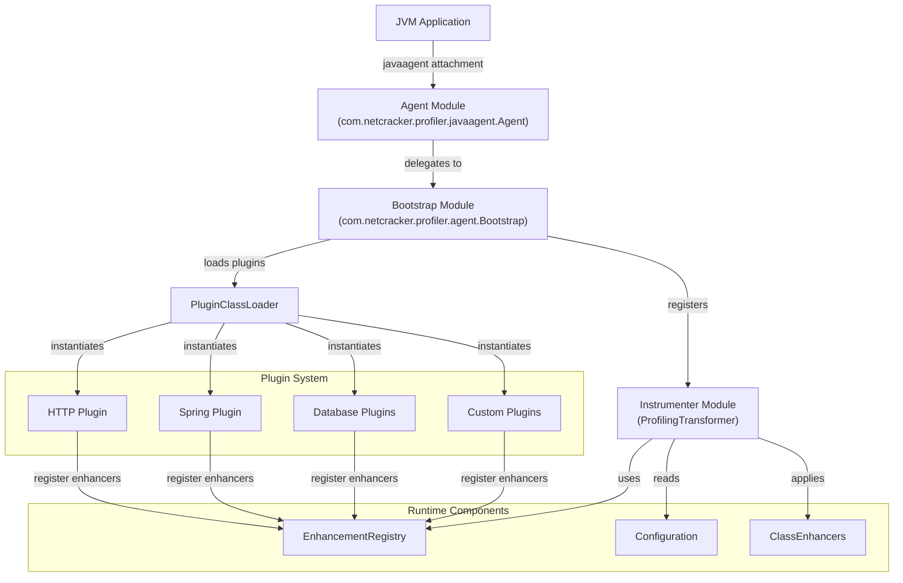
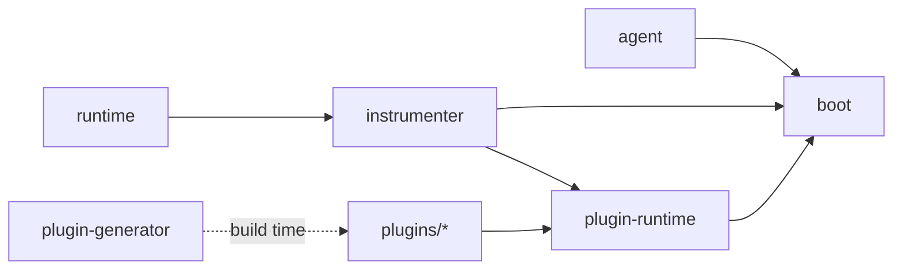

Qubership Profiler Agent is a sophisticated Java instrumentation system that enables continuous tracing and profiling of JVM applications. The architecture follows a multi-layered design with clear separation of concerns.

## Multi-Module Structure

The profiler is organized into several key modules, each with specific responsibilities:

<CardGroup cols={2}>
  <Card title="Agent" icon="door-open" href="/architecture/agent">
    Entry point for JVM attachment via `-javaagent`
  </Card>
  <Card title="Bootstrap" icon="rocket" href="/architecture/agent#bootstrap-class">
    Plugin loading and initialization system
  </Card>
  <Card title="Instrumenter" icon="wrench">
    Bytecode transformation engine using ASM
  </Card>
  <Card title="Plugins" icon="puzzle-piece" href="/architecture/plugins">
    Framework-specific instrumentation modules
  </Card>
</CardGroup>

## Architecture Diagram

## Component Responsibilities

### Agent Module

<ResponseField name="agent" type="Entry Point">
  The `agent` module provides the JVM agent entry points (`premain` and `agentmain`) that delegate to the Bootstrap class. It's intentionally minimal to reduce the agent JAR size.
  
  **Location**: `agent/src/main/java/com/netcracker/profiler/javaagent/Agent.java`
</ResponseField>

### Boot Module

<ResponseField name="boot" type="Core Initialization">
  The `boot` module contains the Bootstrap class and core interfaces. It handles:
  - Plugin discovery and loading via `PluginClassLoader`
  - Plugin deduplication based on `Plugin-Id` manifest attributes
  - Two-phase plugin initialization (`TwoPhaseInit`)
  - JBoss Modules system package configuration
  
  **Location**: `boot/src/main/java/com/netcracker/profiler/agent/`
</ResponseField>

### Instrumenter Module

<ResponseField name="instrumenter" type="Bytecode Transformation">
  The `instrumenter` module implements the bytecode transformation engine:
  - `ProfilingTransformer`: Main `ClassFileTransformer` implementation
  - ASM-based bytecode enhancement
  - Configuration-driven transformation rules
  - Class enhancement and profiling instrumentation
  
  **Location**: `instrumenter/src/main/java/com/netcracker/profiler/agent/ProfilingTransformer.java`
</ResponseField>

### Plugin Runtime

<ResponseField name="plugin-runtime" type="Plugin Infrastructure">
  The `plugin-runtime` module provides base classes and interfaces for plugins:
  - `EnhancerPlugin`: Base class for all plugins
  - `ClassEnhancer`: Interface for bytecode enhancement
  - `EnhancementRegistry`: Registry for managing enhancers
  - `FilteredEnhancer`: Conditional enhancement support
  
  **Location**: `plugin-runtime/src/main/java/com/netcracker/profiler/instrument/enhancement/`
</ResponseField>

### Plugin Generator

<ResponseField name="plugin-generator" type="Build-Time Tool">
  The `plugin-generator` module contains build-time tools for generating plugin code:
  - `GenerateInjector`: Creates enhancer collections from profiled classes
  - ASM-based code generation for efficient plugin initialization
  
  **Location**: `plugin-generator/src/main/java/com/netcracker/profiler/tools/GenerateInjector.java`
</ResponseField>

## Data Flow

<Steps>
  <Step title="Agent Attachment">
    JVM loads the agent via `-javaagent:profiler-agent.jar` parameter. The `Agent.premain()` method is invoked before the application's main method.
  </Step>
  
  <Step title="Bootstrap Initialization">
    `Bootstrap.premain()` discovers and loads plugins from the `lib/` directory. Plugins are deduplicated based on their `Plugin-Id` manifest attribute.
  </Step>
  
  <Step title="Plugin Loading">
    Each plugin JAR is loaded with an isolated `PluginClassLoader`. Entry points defined in the manifest are instantiated.
  </Step>
  
  <Step title="Plugin Registration">
    Plugins register their enhancers with the `EnhancementRegistry`. Configuration is parsed and rules are loaded.
  </Step>
  
  <Step title="Two-Phase Initialization">
    Plugins implementing `TwoPhaseInit` have their `start()` method called after all plugins are loaded.
  </Step>
  
  <Step title="Class Transformation">
    As classes are loaded, `ProfilingTransformer` checks if transformation is required. Matching classes are enhanced using ASM bytecode manipulation.
  </Step>
  
  <Step title="Runtime Profiling">
    Enhanced classes execute profiling code at method entry/exit points, collecting trace data, SQL queries, and performance metrics.
  </Step>
</Steps>

## Key Design Patterns

<AccordionGroup>
  <Accordion title="Plugin Architecture">
    Plugins are loaded with isolated classloaders to avoid conflicts. Each plugin provides enhancers that modify specific framework classes.
  </Accordion>
  
  <Accordion title="Two-Phase Initialization">
    Plugins implementing `TwoPhaseInit` are initialized in two phases:
    1. Construction and registration
    2. Start phase (after all plugins loaded)
    
    This allows plugins to discover and interact with other loaded plugins.
  </Accordion>
  
  <Accordion title="Bytecode Enhancement">
    The profiler uses ASM (Abstract Syntax Tree for Java) to modify bytecode at class-load time. This allows instrumentation without modifying source code.
  </Accordion>
  
  <Accordion title="Configuration-Driven Transformation">
    Transformation rules are defined in XML configuration files. This allows customization of profiling behavior without recompiling the agent.
  </Accordion>
</AccordionGroup>

## Module Dependencies

<Note>
  The `agent` and `boot` modules are intentionally minimal to reduce the bootstrap JAR size. Most functionality is loaded dynamically from plugin JARs.
</Note>

## Thread Safety

The profiler is designed to be thread-safe:

- Configuration is marked `volatile` and can be hot-reloaded
- Plugin registry uses concurrent data structures
- Bytecode transformation is synchronized per class
- Runtime data collection uses lock-free algorithms where possible

## Performance Considerations

<CardGroup cols={2}>
  <Card title="Minimal Overhead" icon="gauge-high">
    Instrumentation only targets configured classes. Most application code runs unmodified.
  </Card>
  
  <Card title="Class Preloading" icon="download">
    Plugins can specify `Preload-Classes-List` in their manifest to preload classes and avoid deadlocks.
  </Card>
  
  <Card title="Lazy Initialization" icon="clock">
    Plugins are loaded lazily. Unused plugins don't consume resources.
  </Card>
  
  <Card title="Bytecode Caching" icon="database">
    Transformed classes can be cached to disk using `storeTransformedClassesPath` configuration.
  </Card>
</CardGroup>

## Next Steps

<CardGroup cols={2}>
  <Card title="Agent Deep Dive" icon="microscope" href="/architecture/agent">
    Learn about the Agent and Bootstrap implementation details
  </Card>
  
  <Card title="Profiler Module" icon="chart-line" href="/architecture/profiler">
    Understand how profiling data is collected and processed
  </Card>
  
  <Card title="Plugin System" icon="plug" href="/architecture/plugins">
    Explore how to create and configure plugins
  </Card>
  
  <Card title="Configuration" icon="gear" href="/configuration">
    Learn how to configure the profiler agent
  </Card>
</CardGroup>
