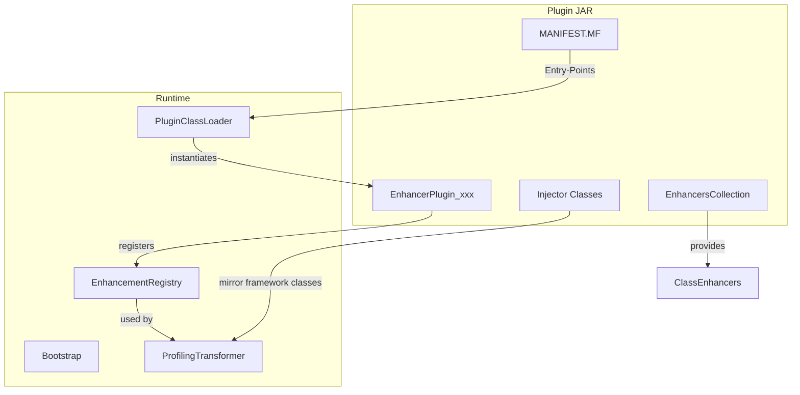

The Qubership Profiler uses a powerful plugin system to provide framework-specific instrumentation. Plugins are JAR files that contain bytecode enhancers for libraries and frameworks.

## Plugin Architecture



## Plugin Structure

A typical plugin JAR contains:

<Steps>
  <Step title="Manifest">
    `META-INF/MANIFEST.MF` with plugin metadata
  </Step>
  
  <Step title="Entry Point">
    A class extending `EnhancerPlugin` (e.g., `EnhancerPlugin_http`)
  </Step>
  
  <Step title="Enhancers Collection">
    Auto-generated class containing `ClassEnhancer` implementations
  </Step>
  
  <Step title="Injector Classes">
    Mirror classes that provide "shadow" implementations of framework classes with `$profiler` methods
  </Step>
</Steps>

## EnhancerPlugin Base Class

All plugins extend the `EnhancerPlugin` base class.

**Location**: `plugin-runtime/src/main/java/com/netcracker/profiler/instrument/enhancement/EnhancerPlugin.java`

```java
public class EnhancerPlugin {
    public final Map<String, ClassEnhancer> enhancersCollection;
    private ConfigStackElement stack;
    
    public EnhancerPlugin() {
        String name = getClass().getName() + "Enhancers";
        // Load the auto-generated enhancers collection
        Class<?> enhancerClass = Class.forName(name, true, 
            getClass().getClassLoader());
        this.enhancersCollection = 
            (Map<String, ClassEnhancer>) enhancerClass.newInstance();
        register();
    }
    
    private void register() {
        EnhancerRegistryPlugin registry = 
            Bootstrap.getPlugin(EnhancerRegistryPlugin.class);
        registry.addEnhancerPlugin(
            getClass().getSimpleName().substring("EnhancerPlugin_".length()), 
            this);
    }
    
    public void init(Element node, Configuration_01 conf) {
        EnhancementRegistry er = conf.getEnhancementRegistry();
        for (Map.Entry<String, ClassEnhancer> entry : 
                enhancersCollection.entrySet()) {
            er.addEnhancer(entry.getKey(), 
                new FilteredEnhancer(this, entry.getValue()));
        }
    }
    
    public boolean accept(ClassInfo info) {
        return true; // Override to filter classes
    }
}
```

<AccordionGroup>
  <Accordion title="Constructor">
    The constructor loads the auto-generated `EnhancerPlugin_xxxEnhancers` class, which is a `HashMap<String, ClassEnhancer>` mapping class names to enhancers.
  </Accordion>
  
  <Accordion title="register()">
    Registers the plugin with the `EnhancerRegistryPlugin`. The plugin ID is extracted from the class name (e.g., `EnhancerPlugin_http` → `http`).
  </Accordion>
  
  <Accordion title="init()">
    Called during configuration loading. Registers all enhancers from the collection with the `EnhancementRegistry`.
  </Accordion>
  
  <Accordion title="accept()">
    Optional filter method. Return `false` to skip enhancement for certain classes. Used for conditional instrumentation.
  </Accordion>
</AccordionGroup>

## ClassEnhancer Interface

Enhancers implement the `ClassEnhancer` interface:

**Location**: `plugin-runtime/src/main/java/com/netcracker/profiler/instrument/enhancement/ClassEnhancer.java`

```java
public interface ClassEnhancer extends Opcodes {
    void enhance(ClassVisitor cv);
}
```

The `enhance()` method uses the ASM `ClassVisitor` API to add methods and fields to the target class.

## Example: HTTP Plugin

Let's examine the HTTP plugin structure:

**Entry Point**: `plugins/http/src/main/java/com/netcracker/profiler/instrument/enhancement/EnhancerPlugin_http.java`

```java
package com.netcracker.profiler.instrument.enhancement;

import com.netcracker.profiler.agent.Configuration_01;
import org.w3c.dom.Element;

public class EnhancerPlugin_http extends EnhancerPlugin {
    @Override
    public void init(Element e, Configuration_01 configuration) {
        super.init(e, configuration);
        
        // Register HTTP-specific parameters for indexing
        configuration.getParameterInfo("web.url").index(true);
        configuration.getParameterInfo("_web.referer").index(true);
        configuration.getParameterInfo("web.method").index(true);
        configuration.getParameterInfo("web.query").index(true);
        configuration.getParameterInfo("web.session.id").index(true);
        configuration.getParameterInfo("web.remote.addr").index(true);
        configuration.getParameterInfo("dynatrace").index(true);
        configuration.getParameterInfo("x-client-transaction-id").index(true);
        configuration.getParameterInfo("X-B3-TraceId").index(true);
        configuration.getParameterInfo("X-B3-ParentSpanId").index(true);
        configuration.getParameterInfo("X-B3-SpanId").index(true);
        configuration.getParameterInfo("x-request-id").index(true);
    }
}
```

<Info>
  The `init()` method registers parameter names for indexing. This allows the profiler to efficiently query traces by these parameters.
</Info>

## Plugin Build Process

Plugins are built using the `plugin-generator` module:

### 1. Write Injector Classes

Create "shadow" classes that mirror framework classes with `$profiler` methods:

```java
// plugins/http/src/injector/java/io/netty/handler/codec/http/HttpRequest.java
package io.netty.handler.codec.http;

public interface HttpRequest {
    // Mirror framework interface
    
    // Add profiler method
    default void setProfilerContext$profiler(Object ctx) {
        // This method will be merged into the real HttpRequest class
    }
}
```

<Note>
  Injector classes must use the **same package and class name** as the framework classes they enhance. Methods ending with `$profiler` will be added to the target class.
</Note>

### 2. Generate Enhancers

The `GenerateInjector` tool processes injector classes:

**Location**: `plugin-generator/src/main/java/com/netcracker/profiler/tools/GenerateInjector.java`

```java
public class GenerateInjector {
    public void run() throws IOException {
        // Generate EnhancerPlugin_xxxEnhancers.java
        pw.print("public class " + className + 
                 " extends HashMap<String, ClassEnhancer> {\n");
        
        for (Path classFile : injectorClasses) {
            processClassFile(classFile);
        }
        
        pw.print("}\n");
    }
    
    private void processClassFile(Path root) throws IOException {
        ClassReader cr = new ClassReader(Files.newInputStream(root));
        ASMifier asmifier = new ASMifier();
        FilterProfiledEntities filter = new FilterProfiledEntities(asmifier);
        cr.accept(filter, ClassReader.EXPAND_FRAMES);
        
        // Generate code to add this enhancer to the map
        pw.print("  {\n");
        pw.print("    put(\"" + className + "\", " +
                 "new ReflectedEnhancerBridge(" + 
                 className + ".class, \"e" + methodId + "\"));\n");
        pw.print("  }\n");
        
        // Generate the enhancer method
        pw.print("  public static void e" + methodId + 
                 "(ClassVisitor classWriter) {\n");
        asmifier.print(pw);
        pw.print("  }\n");
        methodId++;
    }
}
```

**Output**: A Java source file like `EnhancerPlugin_httpEnhancers.java` containing:

```java
public class EnhancerPlugin_httpEnhancers 
        extends HashMap<String, ClassEnhancer> {
    {
        put("io/netty/handler/codec/http/HttpRequest", 
            new ReflectedEnhancerBridge(
                EnhancerPlugin_httpEnhancers.class, "e0"));
    }
    
    public static void e0(ClassVisitor cv) {
        // ASM code to add $profiler methods
        MethodVisitor mv = cv.visitMethod(ACC_PUBLIC, 
            "setProfilerContext$profiler", 
            "(Ljava/lang/Object;)V", null, null);
        // ... bytecode generation ...
    }
}
```

### 3. Build Plugin JAR

The Gradle build compiles the plugin and creates a JAR with the correct manifest:

```kotlin
tasks.jar {
    manifest {
        attributes(
            "Entry-Points" to "com.netcracker.profiler.instrument.enhancement.EnhancerPlugin_http",
            "Plugin-Id" to "http",
            "Preload-Classes-List" to "preload.txt",
            "Implementation-Version" to version
        )
    }
}
```

## Available Plugins

Qubership Profiler includes plugins for many frameworks:

<Tabs>
  <Tab title="HTTP Servers">
    <CardGroup cols={2}>
      <Card title="HTTP" icon="globe">
        Generic HTTP client/server instrumentation (Netty-based)
      </Card>
      <Card title="Tomcat" icon="server">
        Apache Tomcat 9.x and earlier
      </Card>
      <Card title="Tomcat 10" icon="server">
        Apache Tomcat 10.x+ (Jakarta EE)
      </Card>
      <Card title="Undertow" icon="server">
        Undertow 2.2.x and earlier
      </Card>
      <Card title="Undertow 2.3" icon="server">
        Undertow 2.3.x+
      </Card>
      <Card title="Jetty" icon="plane">
        Jetty 9.x and earlier
      </Card>
      <Card title="Jetty 10" icon="plane">
        Jetty 10.x+
      </Card>
    </CardGroup>
  </Tab>
  
  <Tab title="Databases">
    <CardGroup cols={2}>
      <Card title="MySQL" icon="database">
        MySQL JDBC driver
      </Card>
      <Card title="PostgreSQL" icon="database">
        PostgreSQL JDBC driver
      </Card>
      <Card title="Cassandra 3" icon="table">
        DataStax Cassandra 3.x
      </Card>
      <Card title="Cassandra 4" icon="table">
        DataStax Cassandra 4.x
      </Card>
      <Card title="Couchbase" icon="database">
        Couchbase NoSQL
      </Card>
      <Card title="Elasticsearch" icon="magnifying-glass">
        Elasticsearch client
      </Card>
      <Card title="OpenSearch" icon="magnifying-glass">
        OpenSearch client
      </Card>
    </CardGroup>
  </Tab>
  
  <Tab title="Messaging">
    <CardGroup cols={2}>
      <Card title="ActiveMQ" icon="message">
        Apache ActiveMQ
      </Card>
      <Card title="HornetQ" icon="message">
        JBoss HornetQ
      </Card>
      <Card title="RabbitMQ" icon="rabbit">
        RabbitMQ AMQP client
      </Card>
    </CardGroup>
  </Tab>
  
  <Tab title="Frameworks">
    <CardGroup cols={2}>
      <Card title="Spring" icon="leaf">
        Spring Framework core
      </Card>
      <Card title="Spring REST" icon="code">
        Spring REST controllers
      </Card>
      <Card title="Apache Felix" icon="box">
        OSGi Apache Felix
      </Card>
      <Card title="Equinox" icon="box">
        OSGi Eclipse Equinox
      </Card>
      <Card title="Liferay" icon="globe">
        Liferay Portal
      </Card>
    </CardGroup>
  </Tab>
  
  <Tab title="Other">
    <CardGroup cols={2}>
      <Card title="Brave" icon="compass">
        Zipkin Brave tracer
      </Card>
      <Card title="Jaeger" icon="chart-network">
        Jaeger distributed tracing
      </Card>
      <Card title="Ocelot" icon="cat">
        Inspectit Ocelot integration
      </Card>
      <Card title="Jackson" icon="brackets-curly">
        JSON serialization
      </Card>
      <Card title="Log4j" icon="file-lines">
        Log4j enhancer
      </Card>
      <Card title="Quartz" icon="clock">
        Quartz scheduler
      </Card>
    </CardGroup>
  </Tab>
</Tabs>

## Creating a Custom Plugin

Follow these steps to create a custom plugin:

<Steps>
  <Step title="Create Plugin Module">
    Create a new Gradle module under `plugins/`:
    
    ```kotlin
    // plugins/myplugin/build.gradle.kts
    plugins {
        id("build-logic.java-published-library")
    }
    
    dependencies {
        implementation(projects.pluginRuntime)
    }
    ```
  </Step>
  
  <Step title="Create Entry Point">
    Create `EnhancerPlugin_myplugin.java`:
    
    ```java
    package com.netcracker.profiler.instrument.enhancement;
    
    import com.netcracker.profiler.agent.Configuration_01;
    import org.w3c.dom.Element;
    
    public class EnhancerPlugin_myplugin extends EnhancerPlugin {
        @Override
        public void init(Element e, Configuration_01 configuration) {
            super.init(e, configuration);
            // Register parameters for indexing
            configuration.getParameterInfo("custom.param").index(true);
        }
    }
    ```
  </Step>
  
  <Step title="Create Injector Classes">
    Create shadow classes under `src/injector/java/`:
    
    ```java
    // src/injector/java/com/example/TargetClass.java
    package com.example;
    
    public class TargetClass {
        // Add profiler context field
        public Object $profiler;
        
        // Add profiler methods
        public void setContext$profiler(Object ctx) {
            this.$profiler = ctx;
        }
        
        public Object getContext$profiler() {
            return this.$profiler;
        }
    }
    ```
  </Step>
  
  <Step title="Generate Enhancers">
    Run the `GenerateInjector` task during build:
    
    ```kotlin
    tasks.register<JavaExec>("generateEnhancers") {
        classpath = sourceSets["main"].runtimeClasspath
        mainClass.set("com.netcracker.profiler.tools.GenerateInjector")
        args = listOf(
            "$buildDir/generated/sources/enhancers",
            "$projectDir/src/injector/java"
        )
    }
    ```
  </Step>
  
  <Step title="Configure Manifest">
    Update the JAR task to include manifest attributes:
    
    ```kotlin
    tasks.jar {
        manifest {
            attributes(
                "Entry-Points" to "com.netcracker.profiler.instrument.enhancement.EnhancerPlugin_myplugin",
                "Plugin-Id" to "myplugin",
                "Implementation-Version" to version
            )
        }
    }
    ```
  </Step>
  
  <Step title="Build and Deploy">
    Build the plugin and copy to the profiler's `lib/` directory:
    
    ```bash
    ./gradlew :plugins:myplugin:jar
    cp plugins/myplugin/build/libs/myplugin.jar $PROFILER_HOME/lib/
    ```
  </Step>
</Steps>

## Advanced Features

### Conditional Enhancement

Override `accept()` to conditionally enhance classes:

```java
public class EnhancerPlugin_servlet extends EnhancerPlugin {
    @Override
    public boolean accept(ClassInfo info) {
        // Only enhance classes implementing Servlet
        String className = info.getClassName();
        try {
            Class<?> clazz = Class.forName(
                className.replace('/', '.'), 
                false, 
                Thread.currentThread().getContextClassLoader());
            return javax.servlet.Servlet.class.isAssignableFrom(clazz);
        } catch (ClassNotFoundException e) {
            return false;
        }
    }
}
```

### Preloading Classes

Avoid deadlocks by preloading classes:

1. Create `preload.txt` in `src/main/resources/`:
   ```
   com.example.framework.ClassA
   com.example.framework.ClassB
   com.example.framework.ClassC
   ```

2. Reference in manifest:
   ```kotlin
   attributes("Preload-Classes-List" to "preload.txt")
   ```

### Two-Phase Initialization

Implement `TwoPhaseInit` for complex initialization:

```java
public class EnhancerPlugin_complex extends EnhancerPlugin 
        implements TwoPhaseInit {
    
    @Override
    public void start() throws Throwable {
        // Called after all plugins are loaded
        // Can interact with other plugins here
        ProfilerTransformerPlugin transformer = 
            Bootstrap.getPlugin(ProfilerTransformerPlugin.class);
        // Use transformer...
    }
}
```

## Plugin Dependencies

If your plugin needs instrumenter classes, declare a dependency:

```kotlin
// build.gradle.kts
dependencies {
    implementation(projects.pluginRuntime)
    implementation(projects.instrumenter)
}
```

And update the manifest:

```kotlin
attributes("Esc-Dependencies" to "instrumenter")
```

<Warning>
  This changes the plugin's parent classloader, making instrumenter classes visible but potentially increasing memory usage.
</Warning>

## Testing Plugins

Test plugins using the `testkit` module:

```java
@Test
public void testPluginEnhancement() {
    Instrumenter instrumenter = new Instrumenter(config);
    byte[] original = readClassBytes(TargetClass.class);
    byte[] enhanced = instrumenter.transform(
        null, "com/example/TargetClass", null, null, original);
    
    assertNotNull(enhanced);
    // Verify enhanced bytecode contains $profiler methods
}
```

## Best Practices

<AccordionGroup>
  <Accordion title="Minimal Instrumentation">
    Only enhance classes that are absolutely necessary. Excessive instrumentation increases overhead.
  </Accordion>
  
  <Accordion title="Unique Plugin-Id">
    Always specify a unique `Plugin-Id` in the manifest to avoid conflicts.
  </Accordion>
  
  <Accordion title="Version Compatibility">
    Test plugins against multiple versions of the target framework. Use version-specific plugins if needed (e.g., `cassandra` vs `cassandra4`).
  </Accordion>
  
  <Accordion title="Error Handling">
    Handle missing framework classes gracefully. Don't assume all classes are present.
  </Accordion>
  
  <Accordion title="Documentation">
    Document which framework versions are supported in a `README.md` file.
  </Accordion>
</AccordionGroup>

## Troubleshooting

<AccordionGroup>
  <Accordion title="Plugin Not Loading">
    **Symptom**: Plugin JAR is in `lib/` but not being loaded.
    
    **Solutions**:
    - Check manifest has `Entry-Points` attribute
    - Verify entry point class name matches pattern `EnhancerPlugin_xxx`
    - Enable verbose logging: `-Dcom.netcracker.profiler.agent.DumpRootResolverAgent.VERBOSE=true`
  </Accordion>
  
  <Accordion title="Duplicate Plugin-Id">
    **Symptom**: Warning about duplicate `Plugin-Id`, plugins not loading.
    
    **Solution**: Remove duplicate JARs from `lib/` directory. Check for multiple versions.
  </Accordion>
  
  <Accordion title="ClassNotFoundException">
    **Symptom**: Plugin fails to load with `ClassNotFoundException`.
    
    **Solutions**:
    - Add missing dependencies to plugin JAR
    - Use `Esc-Dependencies: instrumenter` if you need instrumenter classes
    - Check for classpath isolation issues
  </Accordion>
  
  <Accordion title="Enhancement Not Applied">
    **Symptom**: Plugin loads but target classes are not enhanced.
    
    **Solutions**:
    - Verify class names match exactly (including package)
    - Check if `accept()` method is filtering out the class
    - Enable class storage to inspect transformed bytecode
  </Accordion>
</AccordionGroup>

## Next Steps

<CardGroup cols={2}>
  <Card title="Architecture Overview" icon="sitemap" href="/architecture/overview">
    Understand the overall profiler architecture
  </Card>
  
  <Card title="Agent Module" icon="door-open" href="/architecture/agent">
    Learn about plugin loading and initialization
  </Card>
  
  <Card title="Profiler Module" icon="chart-line" href="/architecture/profiler">
    Understand bytecode transformation
  </Card>
  
  <Card title="Configuration" icon="gear" href="/configuration">
    Configure plugin behavior
  </Card>
</CardGroup>
