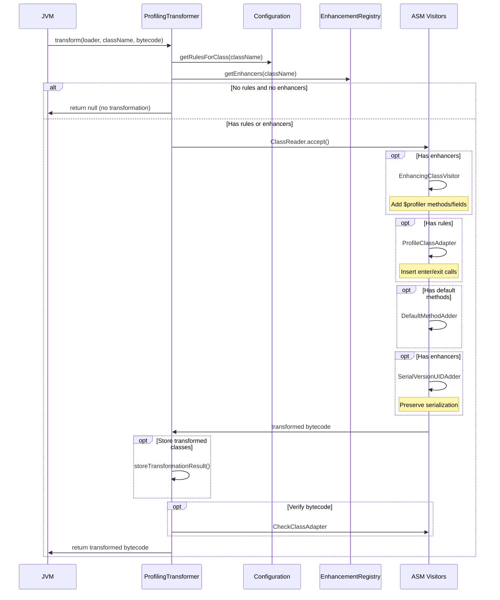
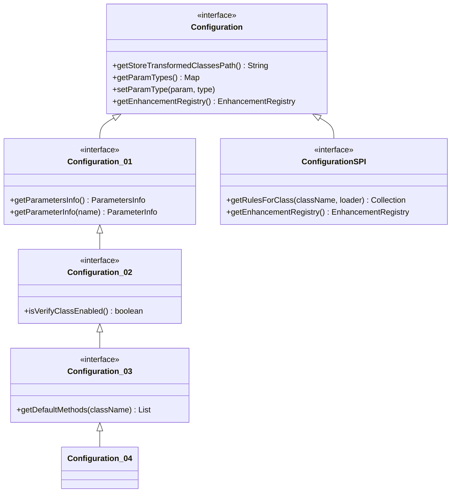

The Profiler module is responsible for bytecode transformation and runtime data collection. It uses the ASM (Abstract Syntax Tree for Java) library to modify class bytecode at load time.

## Core Components

<CardGroup cols={2}>
  <Card title="ProfilingTransformer" icon="arrows-rotate">
    Main `ClassFileTransformer` that intercepts class loading
  </Card>
  
  <Card title="Configuration" icon="file-code">
    XML-based configuration defining transformation rules
  </Card>
  
  <Card title="EnhancementRegistry" icon="database">
    Registry mapping class names to enhancers
  </Card>
  
  <Card title="Instrumenter" icon="screwdriver-wrench">
    Standalone tool for offline instrumentation
  </Card>
</CardGroup>

## ProfilingTransformer

The `ProfilingTransformer` class implements `ClassFileTransformer` and is the heart of the bytecode transformation engine.

**Location**: `instrumenter/src/main/java/com/netcracker/profiler/agent/ProfilingTransformer.java`

### Transformation Flow



### Transform Decision

The transformer only modifies classes that match rules or have registered enhancers:

```java
public boolean transformRequired(String className) {
    Collection<Rule> rules = conf.getRulesForClass(className, null);
    EnhancementRegistry enhancementRegistry = conf.getEnhancementRegistry();
    List<FilteredEnhancer> enhancers = enhancementRegistry.getEnhancers(className);
    return !rules.isEmpty() || !enhancers.isEmpty();
}
```

<Info>
  Classes that don't match any rules or enhancers are **not modified**, ensuring minimal performance impact.
</Info>

### Enhancement vs. Profiling

The transformation process handles two types of modifications:

<Tabs>
  <Tab title="Enhancement">
    **Enhancement** adds new methods and fields to classes using the `EnhancingClassVisitor`. This is used by plugins to inject instrumentation hooks.
    
    **Example**: Adding a `$profiler` field to track HTTP request context.
    
    ```java
    // Before enhancement
    public class HttpRequest {
        private String url;
    }
    
    // After enhancement
    public class HttpRequest {
        private String url;
        public Object $profiler; // Added by enhancer
        
        public void setContext$profiler(Object ctx) { // Added by enhancer
            this.$profiler = ctx;
        }
    }
    ```
  </Tab>
  
  <Tab title="Profiling">
    **Profiling** inserts method entry/exit calls using the `ProfileClassAdapter`. This collects timing and parameter data.
    
    **Example**: Instrumenting a method to track execution time.
    
    ```java
    // Before profiling
    public void processRequest(String data) {
        // method body
    }
    
    // After profiling
    public void processRequest(String data) {
        long startTime = System.nanoTime();
        try {
            // method body
        } finally {
            long duration = System.nanoTime() - startTime;
            ProfilerRuntime.recordMethodExit(duration);
        }
    }
    ```
  </Tab>
</Tabs>

## ASM Visitor Chain

The transformation uses a chain of ASM `ClassVisitor` instances:

```java
ClassWriter cw = new ClassWriter(cr, ClassWriter.COMPUTE_MAXS);
ClassVisitor cv = cw;

if (!enhancers.isEmpty()) {
    cv = new StaticInitMerger(cv);
    cv = new EnhancingClassVisitor(cv, enhancers, classInfo);
}

if (!selectedRules.isEmpty()) {
    cv = new ProfileClassAdapter(cv, name, selectedRules, jarName);
}

cv = addDefaultMethods(cv, defaultMethods, enhancementRegistry, classInfo);

if (!enhancers.isEmpty()) {
    cv = new SerialVersionUIDAdder(cv);
}

cr.accept(cv, ClassReader.EXPAND_FRAMES);
```

<Steps>
  <Step title="ClassWriter">
    `ClassWriter` generates the final bytecode. `COMPUTE_MAXS` flag tells ASM to automatically compute stack map frames.
  </Step>
  
  <Step title="StaticInitMerger">
    Merges multiple static initializers when enhancers add `<clinit>` methods.
  </Step>
  
  <Step title="EnhancingClassVisitor">
    Applies all registered enhancers to add `$profiler` methods and fields.
  </Step>
  
  <Step title="ProfileClassAdapter">
    Inserts profiling instrumentation based on configuration rules.
  </Step>
  
  <Step title="DefaultMethodAdder">
    Adds default method implementations for interfaces.
  </Step>
  
  <Step title="SerialVersionUIDAdder">
    Adds `serialVersionUID` to preserve serialization compatibility.
  </Step>
</Steps>

## Configuration System

The profiler uses XML-based configuration to define transformation rules.

### Configuration Interface Hierarchy



<Note>
  The configuration uses versioned interfaces (`Configuration_01`, `Configuration_02`, etc.) to maintain backward compatibility as new features are added.
</Note>

### EnhancementRegistry Interface

The `EnhancementRegistry` manages the mapping between class names and enhancers:

**Location**: `boot/src/main/java/com/netcracker/profiler/agent/EnhancementRegistry.java`

```java
public interface EnhancementRegistry {
    List getEnhancers(String className);
    void addEnhancer(String className, Object filteredEnhancer);
    Object getFilter(String name);
    void addFilter(String name, Object filter);
}
```

<ResponseField name="getEnhancers" type="List<FilteredEnhancer>">
  Returns all enhancers registered for the given class name. Returns empty list if no enhancers are registered.
</ResponseField>

<ResponseField name="addEnhancer" type="void">
  Registers an enhancer for the specified class name. Multiple enhancers can be registered for the same class.
</ResponseField>

<ResponseField name="getFilter" type="EnhancerPlugin">
  Retrieves a named filter (EnhancerPlugin) for conditional enhancement.
</ResponseField>

<ResponseField name="addFilter" type="void">
  Registers a named filter that can be referenced in configuration rules.
</ResponseField>

## Instrumenter Tool

The `Instrumenter` class provides offline instrumentation of JAR files.

**Location**: `instrumenter/src/main/java/com/netcracker/profiler/Instrumenter.java`

### Use Cases

<CardGroup cols={2}>
  <Card title="Pre-instrumentation" icon="clock">
    Instrument JARs before deployment to reduce startup time
  </Card>
  
  <Card title="Testing" icon="flask">
    Generate instrumented classes for testing without running the full agent
  </Card>
  
  <Card title="Debugging" icon="bug">
    Inspect transformed bytecode to debug instrumentation issues
  </Card>
  
  <Card title="Build Integration" icon="gears">
    Integrate into build pipelines for ahead-of-time instrumentation
  </Card>
</CardGroup>

### Usage

```bash
java -cp instrumenter.jar com.netcracker.profiler.Instrumenter \
  config.xml \
  app.jar \
  lib/dependency.jar
```

**Arguments:**
1. Configuration XML file
2. JAR file(s) to instrument

**Output:** Creates `*.patched` versions of instrumented JARs.

### Processing Flow

```java
public void processJar(String fileName, File destination) throws IOException {
    ZipFile jar = new ZipFile(fileName);
    if (!archiveHasInterestingClasses(jar)) return;
    
    JarOutputStream out = new JarOutputStream(
        new BufferedOutputStream(new FileOutputStream(destination)));
    
    Enumeration<? extends ZipEntry> entries = jar.entries();
    while (entries.hasMoreElements()) {
        ZipEntry zipEntry = entries.nextElement();
        String entryName = zipEntry.getName();
        
        if (entryName.endsWith(".class")) {
            String className = fileNameToClassName(entryName);
            if (pt.transformRequired(className)) {
                byte[] byteCode = pt.transform(null, className, 
                    null, null, readClassBytes(jar, zipEntry));
                out.putNextEntry(new ZipEntry(entryName));
                out.write(byteCode);
            }
        } else {
            copyEntry(out, jar, zipEntry);
        }
    }
}
```

<Info>
  Only classes that require transformation are modified. Other entries (resources, manifests) are copied as-is.
</Info>

## Performance Optimizations

### 1. Lazy Transformation

Classes are only transformed if they match rules or have enhancers. The check is performed before reading the class bytecode:

```java
if (!transformRequired(className)) {
    return null; // No transformation needed
}
```

### 2. Bytecode Verification

Optional bytecode verification can be enabled to catch instrumentation errors:

```java
if (conf.isVerifyClassEnabled()) {
    ClassVisitor checker = new CheckClassAdapter(...);
    ClassReader reader = new ClassReader(bytes);
    reader.accept(checker, 0);
}
```

<Warning>
  Verification adds significant overhead. Only enable during development/debugging.
</Warning>

### 3. Class Storage for Debugging

Transformed classes can be stored to disk for inspection:

```java
final String path = conf.getStoreTransformedClassesPath();
if (path != null) {
    storeTransformationResult(name, bytes, path);
    storeTransformationResult(name + "$$ESC$$ORIGINAL", classfileBuffer, path);
}
```

**Configuration:**

```xml
<configuration>
  <store-transformed-classes-path>/tmp/profiler-classes</store-transformed-classes-path>
</configuration>
```

### 4. Frame Computation

ASM automatically computes stack map frames (required for Java 7+):

```java
ClassWriter cw = new ClassWriter(cr, ClassWriter.COMPUTE_MAXS);
```

This eliminates the need for manual frame calculation.

## Data Collection

While this section focuses on transformation, the instrumented bytecode collects:

<CardGroup cols={2}>
  <Card title="Method Timing" icon="stopwatch">
    Entry/exit timestamps for performance analysis
  </Card>
  
  <Card title="Parameters" icon="list">
    Method parameters and return values
  </Card>
  
  <Card title="SQL Queries" icon="database">
    JDBC queries and bind parameters
  </Card>
  
  <Card title="HTTP Metadata" icon="globe">
    URLs, headers, status codes
  </Card>
</CardGroup>

## Conditional Enhancement

Enhancers can be conditionally applied using filters:

```java
for (Iterator<Rule> it = rules.iterator(); it.hasNext(); ) {
    Rule rule = it.next();
    String ifEnhancer = rule.getIfEnhancer();
    if (ifEnhancer != null) {
        EnhancerPlugin filter = 
            (EnhancerPlugin) enhancementRegistry.getFilter(ifEnhancer);
        if (filter != null && !filter.accept(classInfo)) {
            it.remove(); // Skip this rule
        }
    }
}
```

**Example**: Only instrument Servlet classes:

```xml
<rule class="com/myapp/*" if-enhancer="servlet">
  <method name="doGet" />
</rule>
```

The `servlet` enhancer plugin's `accept()` method checks if the class implements `javax.servlet.Servlet`.

## Error Handling

<AccordionGroup>
  <Accordion title="Transformation Errors">
    If transformation fails, the error is logged and the original bytecode is returned:
    
    ```java
    try {
        return transform(...);
    } catch (RuntimeException e) {
        log.warn("Unable to instrument class {}", name, e);
        throw e; // Re-throw to fail fast
    }
    ```
  </Accordion>
  
  <Accordion title="Verification Failures">
    If bytecode verification fails (when enabled), the transformation is aborted:
    
    ```java
    ClassReader reader = new ClassReader(bytes);
    reader.accept(checker, 0); // Throws if invalid
    ```
  </Accordion>
  
  <Accordion title="Class Loading Deadlocks">
    Plugins can use `Preload-Classes-List` to preload classes and avoid deadlocks during transformation.
  </Accordion>
</AccordionGroup>

## Debugging Transformation

### Enable Verbose Logging

```bash
-Dcom.netcracker.profiler.agent.ProfilingTransformer.log=TRACE
```

### Store Transformed Classes

```xml
<configuration>
  <store-transformed-classes-path>/tmp/profiler-debug</store-transformed-classes-path>
</configuration>
```

This writes:
- `ClassName.class` - Transformed bytecode
- `ClassName$$ESC$$ORIGINAL.class` - Original bytecode

### Use ASM Bytecode Viewer

```bash
java -cp asm-util.jar org.objectweb.asm.util.ASMifier ClassName.class
```

Generates Java code that produces the bytecode, making it easier to understand transformations.

## Next Steps

<CardGroup cols={2}>
  <Card title="Plugin System" icon="puzzle-piece" href="/architecture/plugins">
    Learn how plugins register enhancers
  </Card>
  
  <Card title="Configuration" icon="gear" href="/configuration">
    Configure transformation rules
  </Card>
  
  <Card title="Agent Module" icon="door-open" href="/architecture/agent">
    Understand plugin loading
  </Card>
</CardGroup>
