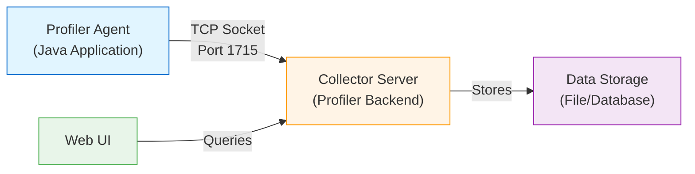

The Qubership Profiler Agent uses a custom binary protocol over TCP sockets to efficiently stream profiling data from instrumented applications to the collector server. This page explains the data collection architecture, transport protocol, and data flow.

## Architecture Overview



### Components

1. **Profiler Agent**: Java agent attached to the application via `-javaagent`
2. **Collector Server**: Receives and stores profiling data streams
3. **Data Storage**: Persistent storage for profiling data and call trees
4. **Web UI**: Browser-based interface for querying and visualizing data

## Data Collection Process

### 1. Instrumentation & Capture

The profiler agent uses bytecode instrumentation to capture method calls:

- **Method entry/exit**: Timestamps, parameters, return values
- **CPU time**: Thread CPU time via JMX
- **Memory allocation**: Object allocation tracking
- **I/O operations**: File and network bytes read/written
- **Thread context**: Thread IDs, suspension time, queue wait time
- **Custom events**: Application-specific events via `Profiler.event()`

### 2. In-Memory Buffering

Captured data is buffered in memory before transmission:

- **Buffer size**: 8KB per stream (configurable via `DATA_BUFFER_SIZE`)
- **Flush triggers**: Buffer full, time interval (5s max), explicit flush request
- **Compression**: Optional GZIP compression (configurable)

### 3. Stream Management

Data is organized into named streams:

- **trace**: Method call trees and execution traces
- **calls**: Aggregated call statistics
- **events**: Custom profiling events
- **threads**: Thread dump data

Each stream has:
- Unique handle (UUID)
- Rolling sequence ID for rotation
- Separate buffering and flush control

## Transport Protocol

### Connection Establishment

The agent establishes a persistent TCP connection to the collector:

```java
// Default connection settings
PORT = 1715 (plain) or 1717 (SSL)
READ_TIMEOUT = 30 seconds
RCV_BUFFER_SIZE = 8KB
SND_BUFFER_SIZE = 8KB
BACKLOG = 50 connections
```

### Protocol Handshake

**Step 1: Client sends protocol version request**
```
Command: COMMAND_GET_PROTOCOL_VERSION_V2 (0x14)
Data:
  - Protocol version (long): 100705
  - Pod name (string): "pod_12345"
  - Microservice name (string): "my-service"
  - Cloud namespace (string): "production"
```

**Step 2: Server responds with negotiated version**
```
Response:
  - Protocol version (long): 100705 or lower
```

Supported protocol versions:
- `100505`: Version 1.5.5 (legacy)
- `100605`: Version 1.6.5 (V2 protocol)
- `100705`: Version 1.7.5 (V3 protocol, current)

### Protocol Commands

The protocol supports the following commands:

| Command | Code | Direction | Description |
|---------|------|-----------|-------------|
| `COMMAND_GET_PROTOCOL_VERSION_V2` | 0x14 | Client → Server | Version negotiation |
| `COMMAND_INIT_STREAM_V2` | 0x15 | Client → Server | Initialize a new data stream |
| `COMMAND_RCV_DATA` | 0x02 | Client → Server | Send data chunk |
| `COMMAND_REQUEST_ACK_FLUSH` | 0x11 | Client → Server | Request explicit acknowledgment |
| `COMMAND_KEEP_ALIVE` | 0x12 | Client → Server | Keep connection alive |
| `COMMAND_CLOSE` | 0x04 | Client → Server | Close connection |
| `COMMAND_REPORT_COMMAND_RESULT` | 0x13 | Client → Server | Report command execution result |

### Stream Initialization

**Client sends COMMAND_INIT_STREAM_V2**
```
Command: 0x15
Data:
  - Stream name (string): "trace"
  - Requested rolling sequence ID (int): 0
  - Reset required (int): 0 or 1
```

**Server responds**
```
Response:
  - Stream handle (UUID): unique identifier
  - Rotation period (long): milliseconds between rotations
  - Required rotation size (long): bytes before rotation
  - Server rolling sequence ID (int): assigned sequence ID
```

### Data Transmission

**Client sends COMMAND_RCV_DATA**
```
Command: 0x02
Data:
  - Stream handle (UUID): identifies the stream
  - Data length (int): number of bytes
  - Data bytes: profiling data payload
```

**Server responds**
```
Response:
  - Number of commands (int): 0 for success, 1 for error
```

**Acknowledgment codes**:
- `0`: Success, no commands to dispatch
- `1`: Error occurred
- `ACK_RESPONSE_MAGIC (0x4B 'K')`: Explicit success
- `ACK_ERROR_MAGIC (0xFF -1)`: Explicit error

### Keep-Alive Mechanism

To maintain the connection:

```java
MAX_IDLE_BEFORE_DEATH = 2 * READ_TIMEOUT + 1000 = 61 seconds
FLUSH_CHECK_INTERVAL = 500ms
MAX_FLUSH_INTERVAL = 5000ms
```

- Agent sends `COMMAND_KEEP_ALIVE` if idle
- Server monitors last activity timestamp
- Connection closed if idle exceeds `MAX_IDLE_BEFORE_DEATH`

## Data Format

### Field Encoding

The protocol uses a custom field encoding for efficient binary serialization:

**FieldIO class**: Handles reading/writing of primitive types and strings

```java
// String encoding
fieldIO.writeString("my-service");
String value = fieldIO.readString();

// Integer encoding
fieldIO.writeInt(12345);
int value = fieldIO.readInt();

// Long encoding
fieldIO.writeLong(1234567890L);
long value = fieldIO.readLong();

// UUID encoding
fieldIO.writeUUID(uuid);
UUID value = fieldIO.readUUID();

// Field with length prefix
fieldIO.writeField(data, length);
int length = fieldIO.readField();
```

### Profiling Data Structure

Profiled call data includes:

```java
// Call record fields
C_TIME              // Start time (milliseconds since epoch)
C_DURATION          // Duration (milliseconds)
C_CPU_TIME          // CPU time (milliseconds)
C_QUEUE_WAIT_TIME   // Time waiting in queue
C_SUSPENSION        // Thread suspension time
C_CALLS             // Number of calls
C_METHOD            // Method tag ID
C_TRANSACTIONS      // Transaction count
C_MEMORY_ALLOCATED  // Bytes allocated
C_LOG_GENERATED     // Log bytes generated
C_LOG_WRITTEN       // Log bytes written
C_FILE_TOTAL        // File I/O total bytes
C_FILE_WRITTEN      // File bytes written
C_NET_TOTAL         // Network I/O total bytes
C_NET_WRITTEN       // Network bytes written
C_PARAMS            // Parameter map
C_TRACE_ID          // Distributed trace ID
C_SPAN_ID           // Distributed span ID
C_NAMESPACE         // Kubernetes namespace
C_SERVICE_NAME      // Microservice name
```

### Tags & Parameters

Methods and events are identified by tags:

```java
// Tag format
"<return-type> <package>.<class>.<method>(<args>) (<source>)"

// Example tag
"void com.example.MyService.processRequest(String) (MyService.java:42)"

// Tags are assigned numeric IDs for efficient storage
tagId = 12345;
tags.put(tagId, tagString);
```

Parameters are key-value pairs indexed for searching:

```java
// Parameter registration
<parameter name="trace.id" index="true" list="true"/>

// Parameter values stored in call record
params.put(paramId, "abc123def456");
```

## Configuration

### Agent Configuration

Configure the collector endpoint via environment variables or system properties:

```bash
# Environment variables
export REMOTE_DUMP_HOST="collector.example.com"
export REMOTE_DUMP_PORT_PLAIN="1715"
export REMOTE_DUMP_PORT_SSL="1717"

# System properties
java -javaagent:profiler.jar \
     -Dprofiler.dump.host=collector.example.com \
     -Dprofiler.dump.port=1715 \
     -jar application.jar
```

### Connection Settings

Adjust buffer sizes and timeouts if needed:

```bash
# Increase buffer size for high-volume profiling
-Dprofiler.buffer.size=16384

# Adjust read timeout
-Dprofiler.read.timeout=60000

# Enable compression
-Dprofiler.compression=true
```

## Monitoring Data Flow

### Agent-Side Metrics

The agent logs connection status and transmission metrics:

```
[Profiler] Connected to collector at collector.example.com:1715
[Profiler] Stream initialized: trace -> a1b2c3d4-...
[Profiler] Data transmitted: 2048 bytes (stream: trace)
[Profiler] Flush completed: 5 streams, 12KB total
```

### Collector-Side Metrics

The collector (e.g., MockCollectorServer) exposes metrics:

```java
// Connection metrics
mockServer.mockConnections.count();  // Total connections

// Stream metrics
metricRegistry.counter("mock.server.streams", "stream_name", "trace");
metricRegistry.counter("mock.server.stream.chunks", "stream_name", "trace");
metricRegistry.counter("mock.server.stream.bytes", "stream_name", "trace");
```

## Testing with Mock Collector

For integration testing, use the included `MockCollectorServer`:

```java
try (MockCollectorServer server = new MockCollectorServer(1715, 50)) {
    server.start();
    
    // Run profiled application
    // ...
    
    // Check metrics
    double connections = server.mockConnections.count();
    System.out.println("Connections: " + connections);
}
```

See the [Mock Collector Integration Guide](https://github.com/Netcracker/qubership-profiler-agent/blob/main/mock-collector/INTEGRATION.md) for details.

## Troubleshooting

### Connection Refused

**Problem**: Agent cannot connect to collector

**Solutions**:
- Verify collector is running and listening on the configured port
- Check firewall rules allow traffic on port 1715/1717
- Confirm `REMOTE_DUMP_HOST` resolves correctly
- Test connectivity: `telnet collector.example.com 1715`

### Data Not Appearing

**Problem**: Agent connects but no data appears

**Solutions**:
- Check profiling is enabled (duration threshold met)
- Verify streams are initialized successfully
- Increase flush frequency for testing
- Review collector logs for protocol errors
- Check collector has sufficient disk space

### Connection Timeouts

**Problem**: Frequent connection timeouts

**Solutions**:
- Increase `PLAIN_SOCKET_READ_TIMEOUT`
- Check network latency between agent and collector
- Reduce flush interval to keep connection active
- Enable keep-alive packets

### High Memory Usage

**Problem**: Agent uses excessive memory

**Solutions**:
- Reduce buffer sizes
- Increase flush frequency
- Lower profiling threshold to reduce data volume
- Disable compression if CPU-bound

## Security Considerations

### SSL/TLS Support

For encrypted communication, use the SSL port:

```bash
export REMOTE_DUMP_PORT_SSL="1717"
-Dprofiler.ssl.enabled=true
-Dprofiler.ssl.keystore=/path/to/keystore.jks
-Dprofiler.ssl.keystore.password=password
```

### Network Isolation

Best practices:
- Run collector on a private network
- Use firewall rules to restrict access to collector port
- Consider VPN or SSH tunneling for remote profiling
- Implement authentication at the application layer if needed

## Performance Considerations

### Bandwidth Usage

Typical bandwidth requirements:

- **Low activity**: ~10-50 KB/s per application
- **Medium activity**: ~50-200 KB/s per application
- **High activity**: ~200-500 KB/s per application

### Overhead

Profiling overhead depends on:

- **Instrumentation scope**: Number of instrumented classes
- **Call frequency**: Calls per second
- **Buffer size**: Larger buffers reduce flush frequency
- **Compression**: Adds CPU overhead but reduces network usage

Typical overhead: **1-5% CPU, 10-50 MB memory**

## Next Steps

<CardGroup cols={2}>
  <Card title="Distributed Tracing" icon="network-wired" href="./distributed-tracing">
    Integrate with Brave, Jaeger, and OpenTelemetry
  </Card>
  <Card title="Web UI" icon="browser" href="./web-ui">
    Visualize and analyze profiling data
  </Card>
</CardGroup>