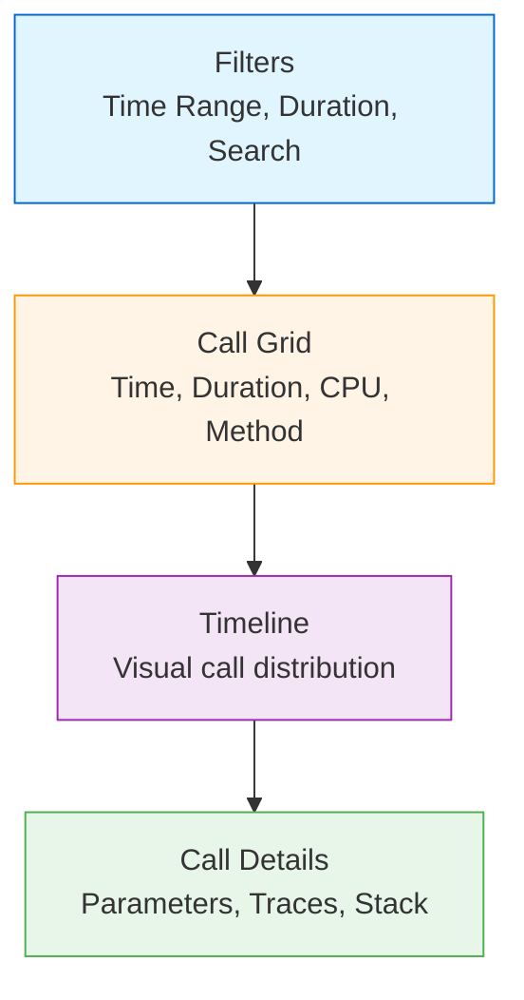

The Qubership Profiler includes a powerful web-based user interface for querying, filtering, and visualizing profiling data. The UI provides real-time insights into application performance, call trees, and distributed traces.

## Overview

The Web UI is a single-page application built with modern JavaScript technologies:

- **Frontend**: Vanilla JavaScript with jQuery and SlickGrid
- **Visualization**: Dygraphs for charts, CHAP Timeline for traces
- **Styling**: jQuery UI themes with custom profiler styles
- **Build**: Vite for bundling and development

## Accessing the UI

Once the profiler server is running, access the web UI:

```
http://your-profiler-server:port/
```

**Default URL**: `http://localhost:8080/` (port may vary)

## Main Views

### 1. Call List View

The primary view for browsing profiled calls:



**Features**:
- Sortable columns (time, duration, CPU, memory, I/O)
- Real-time filtering by time range and duration
- Search with mandatory/excluded terms
- Timeline visualization of call distribution
- Multi-select for grouping related calls

### 2. Call Tree View

Detailed hierarchical view of method call stacks:

- **Flame graph**: Visual representation of time spent in methods
- **Call hierarchy**: Parent-child relationships between methods
- **Drill-down**: Click to expand/collapse call subtrees
- **Aggregation**: Combined statistics for repeated calls

### 3. Configuration View

Manage profiler settings:

- Enable/disable profiling
- Configure instrumentation rules
- Set duration thresholds
- Manage parameters and tags

## Key Features

### Time Range Selection

Select the time window for viewing calls:

**Quick options**:
- Last 15 minutes
- Last hour
- Last 2 hours
- Last 4 hours
- Custom range

**Custom range selector**:
```
Date/Time: 2024-03-12 10:00:00 to 2024-03-12 11:00:00
Timezone: America/New_York (or select from dropdown)
```

**Auto-update mode**:
- Enable to continuously show latest data
- Time range automatically advances with current time
- Useful for live monitoring

<Tip>
**Keyboard shortcut**: Press `r` to refresh and show the latest 15 minutes
</Tip>

### Duration Filtering

Filter calls by execution duration:

**Quick options**:
- All calls (>= 0ms)
- >= 10ms
- >= 100ms
- >= 500ms
- >= 1 second
- >= 5 seconds
- >= 30 seconds

**Custom duration queries**:
```
>= 500ms          # Calls taking 500ms or more
100ms..500ms      # Calls between 100ms and 500ms
<= 500ms          # Calls taking 500ms or less
= 500ms           # Calls taking exactly 500ms
```

### Search & Filtering

Powerful search syntax for finding specific calls:

**Basic search**:
```
myMethod          # Contains "myMethod"
"exact phrase"    # Exact phrase match
```

**Boolean operators**:
```
+mandatory        # Must contain "mandatory"
-excluded         # Must NOT contain "excluded"
term1 term2       # Contains term1 OR term2
+term1 +term2     # Must contain both term1 AND term2
```

**Parameter-based search**:
```
$web.url=/api/users                    # Web URL parameter
$trace.id=abc123                       # Trace ID
$nc.user=admin                         # User parameter
$brave.span_id=def456                  # Brave span ID
+$node.name=clust1 -$web.url=.jsp      # Combine filters
```

**Example queries**:
```
# All admin requests to cluster1
+$node.name=clust1 $nc.user=admin

# Requests matching "test page" except to cluster2
"test page" -$node.name=clust2

# Specific trace ID
+$trace.id=abc123def456

# Slow database queries
+jdbc +query >= 1000ms
```

<Tip>
**Keyboard shortcut**: Press `/` or `s` to focus the search box
</Tip>

### Timeline Visualization

Interactive timeline showing call distribution over time:

**Features**:
- Horizontal bars represent individual calls
- Bar length indicates duration
- Color coding for different call types
- Zoom in/out with mouse wheel or keyboard
- Pan left/right to navigate time

**Keyboard shortcuts**:
- `←` / `→`: Pan left/right
- `↑` / `↓` or `+` / `-`: Zoom in/out
- `Ctrl+↑` / `Ctrl+↓`: Adjust timeline height

### POD & Service Filtering (Cloud Features)

Filter calls by Kubernetes pod and service:

**Enable cloud features**:
- Check "Show Cloud UI features" checkbox
- Additional columns appear: Namespace, Service Name

**POD filter**:
```
pod_name=my-pod-12345
service_name like my-service%
namespace=production
```

**Show Active PODs**:
- Click button to see list of active pods
- Select pods to filter calls
- View pod-specific statistics

### Call Grouping

Group related calls for analysis:

1. **Select multiple calls** using checkboxes or Ctrl+Click
2. **Click "Group" button** to open merged call tree
3. **View combined statistics** across selected calls
4. **Analyze relationships** between calls

**Use cases**:
- Compare similar requests
- Analyze distributed transaction flows
- Debug correlated failures

### Data Export

**Download profiling data**:
- **Download dump**: Export raw profiling data for offline analysis
- **Download as XLSX**: Excel spreadsheet with call data
- **Download call tree**: ZIP file with call tree visualization

## UI Components & Libraries

### Core Libraries

The UI is built with the following libraries (from `package.json`):

```json
{
  "dependencies": {
    "jquery": "^3.5.1",
    "jquery-ui": "^1.13.2",
    "slickgrid": "^5.15.2",
    "dygraphs": "^2.2.1",
    "chap-timeline": "^2.9.2",
    "moment": "^2.30.1",
    "moment-timezone": "^0.6.0",
    "bootstrap-datepicker": "^1.10.0",
    "sortablejs": "^1.15.6",
    "vkbeautify": "^0.99.3",
    "code-prettify": "^0.1.0"
  },
  "devDependencies": {
    "vite": "7.3.1",
    "vite-plugin-singlefile": "2.3.0"
  }
}
```

### Key UI Components

**SlickGrid**: High-performance data grid
- Handles thousands of rows efficiently
- Virtual scrolling for large datasets
- Sortable and resizable columns
- Custom formatters for data display

**Dygraphs**: Interactive time-series charts
- Zoom and pan
- Automatic axis scaling
- Tooltip on hover

**CHAP Timeline**: Timeline visualization
- Timeline.js-based component
- Configurable time scales
- Event grouping

**Moment.js**: Time and timezone handling
- Format timestamps
- Timezone conversions
- Duration calculations

## Column Reference

Available columns in the Call List grid:

| Column | Description | Format |
|--------|-------------|--------|
| **Time** | Call start time | HH:MM:SS.mmm |
| **Duration** | Total execution time | ms or seconds |
| **CPU Time** | Thread CPU time | ms or seconds |
| **Queue Wait** | Time waiting in queue | ms |
| **Suspension** | Thread suspension time | ms |
| **Calls** | Number of sub-calls | Integer |
| **Method** | Fully qualified method name | package.Class.method |
| **Transactions** | Transaction count | Integer |
| **Memory** | Bytes allocated | KB/MB/GB |
| **Log Generated** | Log bytes generated | KB/MB |
| **Log Written** | Log bytes written | KB/MB |
| **File Total** | Total file I/O | KB/MB |
| **File Written** | File bytes written | KB/MB |
| **Net Total** | Total network I/O | KB/MB |
| **Net Written** | Network bytes written | KB/MB |
| **Trace ID** | Distributed trace ID | Hex string |
| **Span ID** | Distributed span ID | Hex string |
| **Namespace** | Kubernetes namespace | String |
| **Service Name** | Microservice name | String |

## Customization

### Personal Settings

Configure display preferences:

**Number formatting**:
- `1,234` (thousands separator) or `1234`
- Integer/BigInteger format options

**Time formatting**:
- Milliseconds: `400ms` or `0.400s`
- Omit milliseconds below threshold
- HMS format for large durations

**Timezone**:
- Select from dropdown or type to search
- Persist timezone preference in cookies
- Adjust time fields when changing timezone

### Hidden Columns

Show/hide columns as needed:

1. Right-click column header
2. Select "Hide Column"
3. Use column picker to restore hidden columns

### Themes

The UI supports jQuery UI themes:

- Light theme (default)
- Dark theme (via custom CSS)
- Custom theme (modify `jquery-ui.theme.css`)

## Performance Optimization

### Large Datasets

When viewing large numbers of calls:

**Filtering strategies**:
- Use duration threshold to reduce result set
- Narrow time range to specific incident window
- Search for specific methods or parameters
- Enable "Hide proxy/system requests" to filter noise

**UI optimizations**:
- SlickGrid virtual scrolling handles 10,000+ rows
- Lazy loading of call details
- Throttled rendering on scroll

### Network Optimization

Minimize data transfer:

- GZIP compression enabled by default
- Paginated data loading
- Incremental updates in auto-update mode

## Browser Compatibility

Supported browsers:

- **Chrome**: Version 90+ (recommended)
- **Firefox**: Version 88+
- **Safari**: Version 14+
- **Edge**: Version 90+

**Internet Explorer**: Limited support (IE 11 with polyfills)

## Accessibility

### Keyboard Navigation

Full keyboard support:

- `Tab`: Navigate between controls
- `Space`: Toggle checkboxes/buttons
- `Enter`: Activate buttons, apply filters
- `Esc`: Close dialogs/modals

### Screen Reader Support

- Semantic HTML elements
- ARIA labels for controls
- Accessible table structure

## Troubleshooting

### UI Not Loading

**Problem**: Blank page or loading error

**Solutions**:
- Clear browser cache and reload
- Check browser console for JavaScript errors
- Verify server is running and reachable
- Check network tab for failed resource requests

### Slow Performance

**Problem**: UI is sluggish or unresponsive

**Solutions**:
- Reduce time range to limit data volume
- Increase duration threshold
- Enable proxy/system request filtering
- Close other browser tabs
- Use Chrome/Firefox for best performance

### Timeline Not Appearing

**Problem**: Timeline doesn't display

**Solutions**:
- Uncheck "Hide timeline" option
- Adjust timeline height (Ctrl+↑/↓)
- Check browser console for errors
- Verify data has time information

### Search Not Working

**Problem**: Search returns no results

**Solutions**:
- Verify search syntax (use quotes for exact phrases)
- Check parameter names match configuration
- Ensure time range includes relevant data
- Try simpler search terms first

## Development

To develop or customize the UI:

### Setup

```bash
cd profiler-ui
yarn install
```

### Development Server

```bash
yarn dev
# Opens at http://localhost:5173
```

### Build

```bash
yarn build
# Outputs to dist/
```

### Project Structure

```
profiler-ui/
├── src/
│   ├── profiler.mjs           # Main application entry
│   ├── callList.mjs           # Call list view
│   ├── tree.mjs               # Call tree view
│   ├── dataFormat.mjs         # Data formatting utilities
│   ├── decoders.mjs           # Protocol decoders
│   ├── profilerSettings.mjs   # Settings management
│   └── utils.mjs              # Utility functions
├── styles/
│   ├── prof.css               # Main profiler styles
│   └── jquery-ui.theme.css    # jQuery UI theme
├── index.html                 # Main HTML page
├── tree.html                  # Call tree page
├── package.json
└── vite.config.mjs
```

## Next Steps

<CardGroup cols={2}>
  <Card title="Distributed Tracing" icon="network-wired" href="./distributed-tracing">
    Integrate with tracing systems to correlate traces
  </Card>
  <Card title="Data Collection" icon="database" href="./data-collection">
    Understand how data flows from agent to UI
  </Card>
</CardGroup>